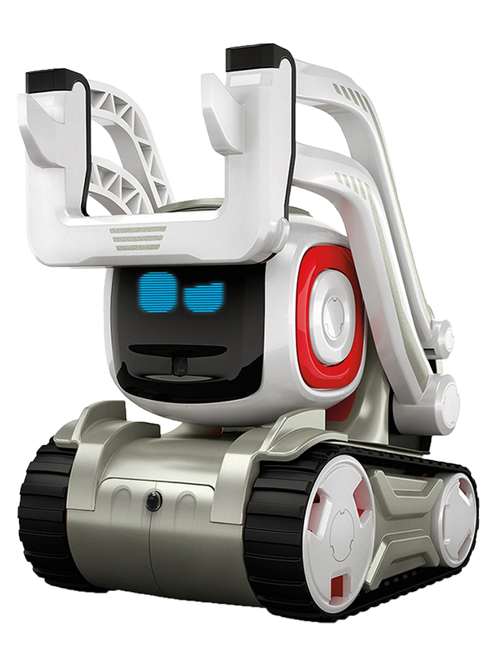

Welcome to Cozmo's documentation!
=================================
Hello everyone !!

Our project is an academic project around the Anki's robot named **Cozmo**.

| The goal of our project is to perform a finger counter with Cozmo.
|
| We use its camera to count our fingers on our hands, one or two hands, it will do it.
| After we get the first number, we need an operator and we will got it by typing on one of the three cubes front of you.

.. toctree::
   :hidden:
   :maxdepth: 1
   :caption: Fingers Detection

   fingers_detection

.. toctree::
   :hidden:
   :maxdepth: 2
   :caption: Operation and Cubes

   operation_cubes