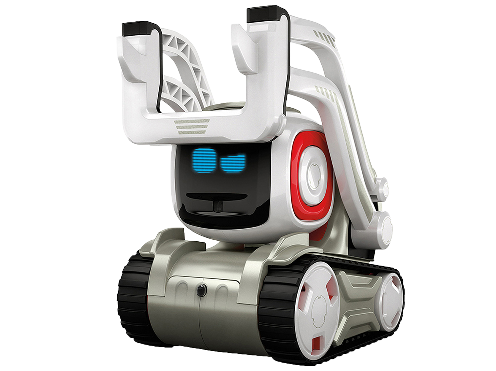

.. Cozmo documentation master file, created by
   sphinx-quickstart on Tue Nov 16 17:04:58 2021.
   You can adapt this file completely to your liking, but it should at least
   contain the root `toctree` directive.

Welcome to Cozmo's documentation!
=================================

Hello everyone !!

Our project is an academic project around the Anki's robot named **Cozmo**.

.. toctree::
   :maxdepth: 2
   :caption: Contents:

Indices and tables
==================

* :ref:`genindex`
* :ref:`modindex`
* :ref:`search`
